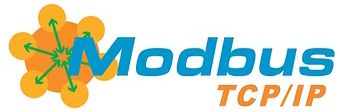
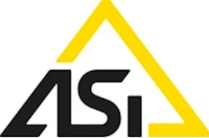

# Vinicius Marconatto

**`Desenvolvedor de softwares para aplicações industriais & Desenvolvimento de Programas para PLC´s, Sistema Scada`**

Sou Vinicius Marconatto, apaixonado por integração de sistemas e desenvolvimento de soluções de software para ambientes industriais.
Atuo desde a programação de CLPs e Sistemas SCADA, até a criação de aplicações customizadas para coleta, tratamento, armazenamento e visualização de dados industriais — local/cloud

Sólidos conhecimentos em protocolos industriais, instrumentação, e desenvolvimento full stack com foco em aplicações para supervisão, métricas e monitoramento em tempo real.

Estou sempre evoluindo meu código através de boas práticas, padrões, refatoração e documentação estruturada.

### 🤖 Linguagens e Tecnologias

 
 

